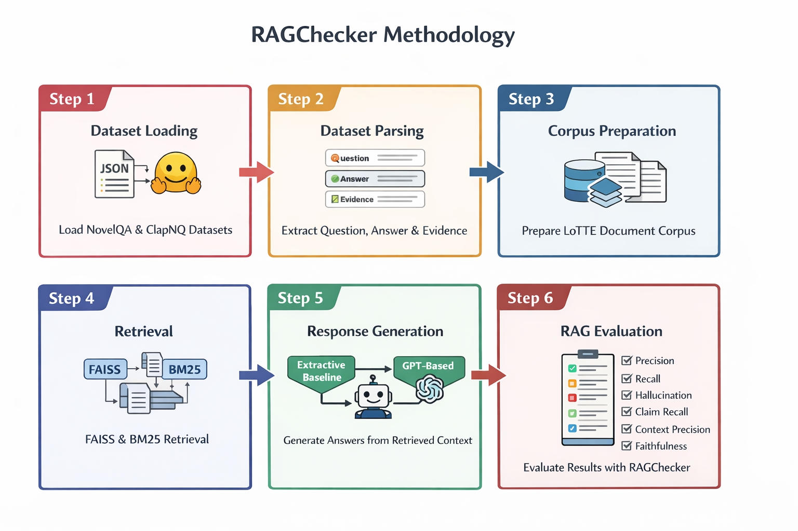
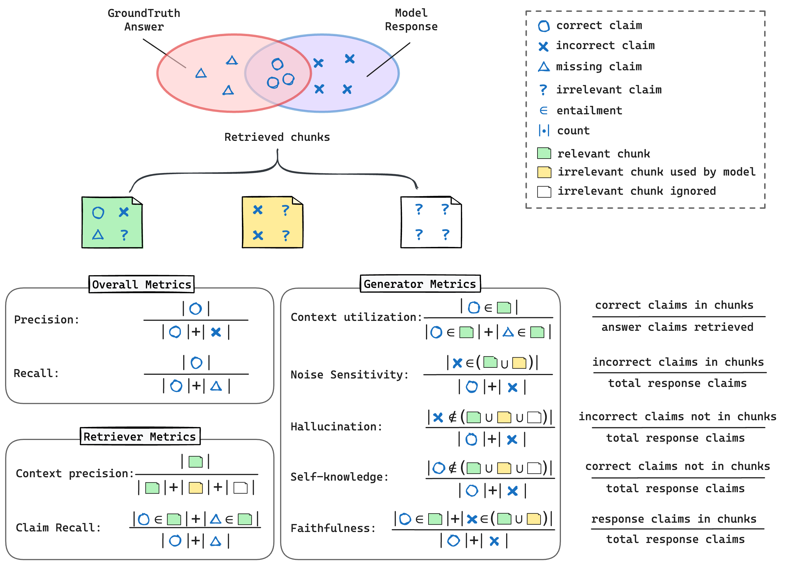
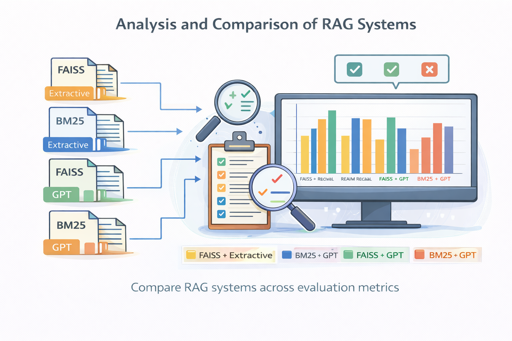

# RAGCHECKER: A Fine-grained Framework for Diagnosing Retrieval-Augmented Generation

> DS8008 Final Project — NLP / Text Mining

---

## 📌 Overview

This project implements and evaluates multiple Retrieval-Augmented Generation (RAG) systems using the **RAGChecker** framework. The objective is to analyze how different retrieval strategies and generation methods affect answer quality, factual reliability, and system performance.

RAG systems combine:

- a **retriever** — to fetch relevant documents  
- a **generator** — to produce final answers using retrieved context  

Evaluating RAG systems is challenging because errors may come from poor retrieval, weak generation, or both. To address this, the project applies **claim-level evaluation**, allowing fine-grained diagnosis of system behavior.

This work reproduces the core ideas of the original **RAGChecker** research paper while adapting the implementation to a practical project setting.

---

## ⚙️ Methodology

A complete RAG pipeline was implemented consisting of:

- Dataset preparation  
- Indexing and retrieval  
- Response generation  
- Fine-grained evaluation  

### 🔹 Retrieval Methods

- **FAISS** — dense semantic retrieval using vector embeddings  
- **BM25** — sparse lexical retrieval using keyword matching  

### 🔹 Generation Methods

- **Extractive Baseline** — returns content directly from retrieved documents  
- **GPT-based Generation** — synthesizes answers using retrieved context  

### 🔹 RAG Systems Evaluated

- FAISS + Extractive  
- BM25 + Extractive  
- FAISS + GPT  
- BM25 + GPT  

These combinations allow comparison between:

- Dense vs Sparse retrieval  
- Extractive vs Generative answering  

---

## 🖼️ Methodology Pipeline

<p align="center">
  
</p>

---

## 📊 Evaluation Framework

This project uses **RAGChecker**, a claim-level evaluation framework designed to separately measure retriever quality and generator quality.

Instead of evaluating only full responses, answers are broken into factual claims and compared against retrieved documents and ground-truth answers.

### 🔹 Metrics Used

### Overall Metrics

- Precision  
- Recall  
- F1 Score  

### Retriever Metrics

- Claim Recall  
- Context Precision  

### Generator Metrics

- Context Utilization  
- Faithfulness  
- Hallucination  
- Self Knowledge  
- Noise Sensitivity (Relevant)  
- Noise Sensitivity (Irrelevant)  

---

## 🖼️ Evaluation Metrics

<p align="center">
  
</p>

---

## 📈 Results & Analysis

Experiments were conducted on **NovelQA** and **CLAPNQ**, followed by averaged results across both datasets.

### 🔹 Key Findings

- **GPT-based systems achieved the highest precision**, producing stronger final answers  
- **FAISS_GPT achieved the highest recall and claim recall**, showing stronger semantic retrieval coverage  
- **BM25_GPT achieved the best average precision**, making it the strongest balanced system overall  
- **Extractive systems achieved the highest faithfulness and lowest hallucination**, showing stronger factual grounding  

### 🔁 Trade-offs Observed

- **FAISS** → Better semantic coverage, higher recall, but noisier retrieval  
- **BM25** → Better lexical precision, lower hallucination, more stable outputs  
- **GPT Generation** → Better answer quality, but higher hallucination risk  
- **Extractive Generation** → Strong grounding, but weaker completeness and flexibility  

---

## 🖼️ System Comparison

<p align="center">
  
</p>

---

## 📁 Project Structure

```text
ragchecker-project/
│
├── README.md
├── ragchecker.ipynb
│
├── data/
│   └── sample_data.json
│
├── src/
│   ├── retrieval.py
│   ├── generation.py
│   └── evaluation.py
│
├── images/
│   ├── pipeline.png
│   ├── metrics.png
│   └── analysis.png

```

---

## 📚 Datasets

This project uses the following datasets:

- NovelQA
- CLAPNQ
- LoTTE (Science Corpus)
🔗 Full Dataset Sources
- https://huggingface.co/datasets
- https://ir-datasets.com/

---

## 🚀 How to Run
- 1️⃣ Open the notebook
  ragchecker.ipynb
- 2️⃣ Install dependencies
  - pip install pandas numpy datasets sentence-transformers faiss-cpu rank-bm25 openai ragchecker
- 3️⃣ Run all notebook cells sequentially

---

## 🧠 Key Insights
- RAG performance depends on the interaction between retrieval and generation
- Strong generation does not always guarantee factual reliability
- Dense retrieval improves coverage, while sparse retrieval improves precision
- Fine-grained evaluation is more informative than coarse answer-level metrics
- Different RAG systems optimize different objectives (accuracy vs grounding)

---

## 🔮 Future Improvements
- Use stronger dense retrievers such as E5-Mistral or reranking models
- Add prompt engineering / constrained generation to reduce hallucination
- Evaluate on larger multi-domain benchmarks
- Re-implement claim extraction and entailment checking manually
- Explore hybrid retrieval (FAISS + BM25)

---

## 👥 Authors
- Amadike Chidera Lilian
- Ogakwu Jeff
- David Philemon

---

## 📄 Citation
@misc{ru2024ragcheckerfinegrainedframeworkdiagnosing,
  title={RAGChecker: A Fine-grained Framework for Diagnosing Retrieval-Augmented Generation},
  author={Dongyu Ru and Lin Qiu and Xiangkun Hu and Tianhang Zhang and Peng Shi and others},
  year={2024},
  eprint={2408.08067},
  archivePrefix={arXiv},
  primaryClass={cs.CL},
  url={https://arxiv.org/abs/2408.08067}
}

---

## 📌 Notes
- Only a subset of datasets is included locally due to storage limitations
- Full datasets should be downloaded separately
- Results may vary depending on API model version or retrieval parameters
- Notebook is designed for educational and research purposes
